
## Hello SIBKM Java Batch 7 🔥

Nama: Muhammad Hadi Royan Firdaus  
Tugas: S2-Git-Versioning

### Tugas: Fast Forward

1. Membuat folder dan melakukan git init  
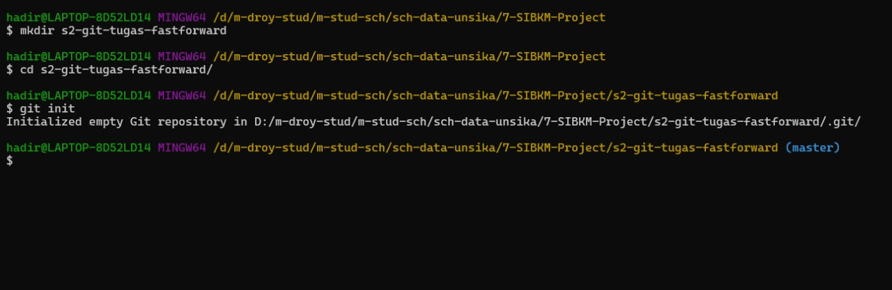

2. Membuat dan checkout branch ParentHadi  
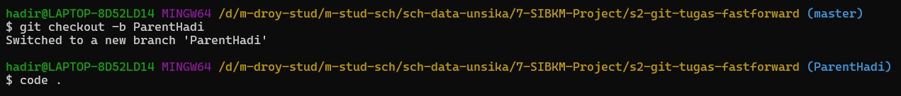

3. Membuat file.txt di branch ParentHadi
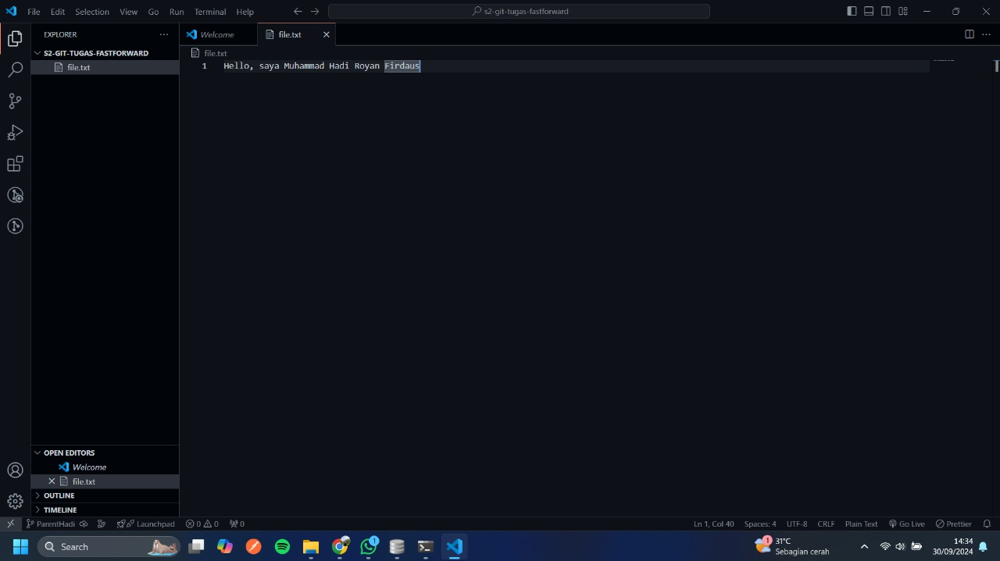

4. Melakukan commit branch ParentHadi
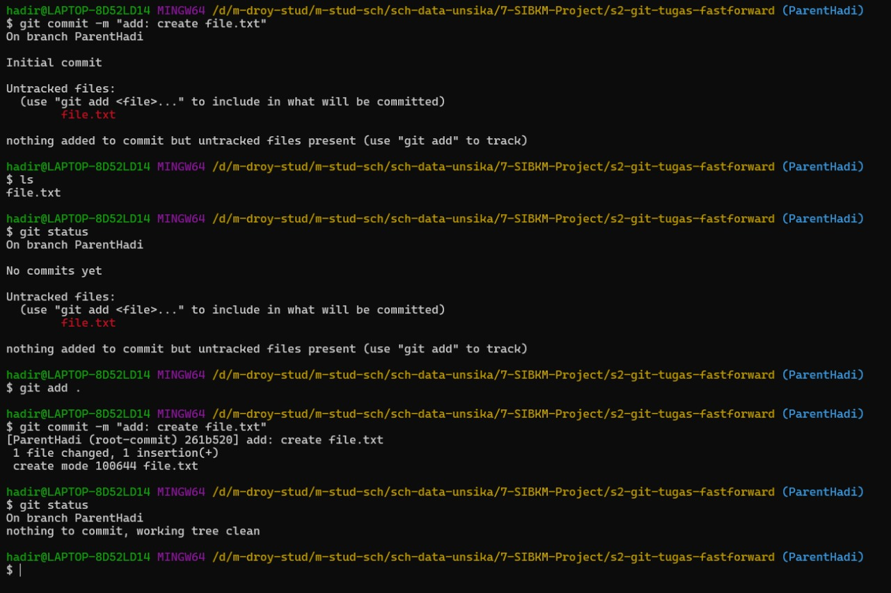

5. Membuat dan checkout branch ChildHadi
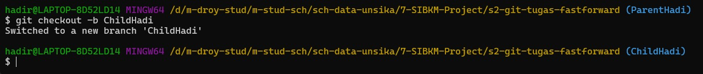

6. Merubah file.txt di branch Childhadi
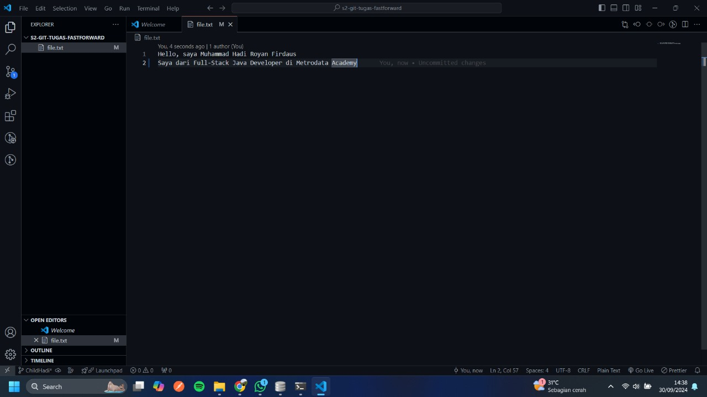

7. Melakukan commit branch ChildHadi
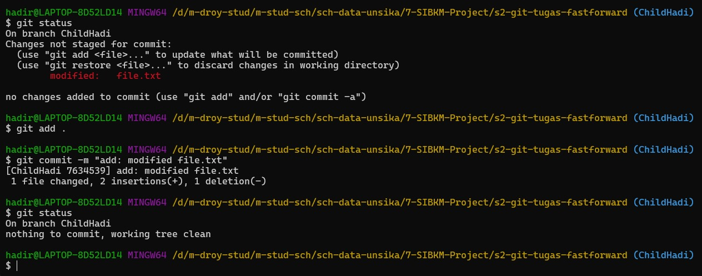

8. Melakukan merge fast forward
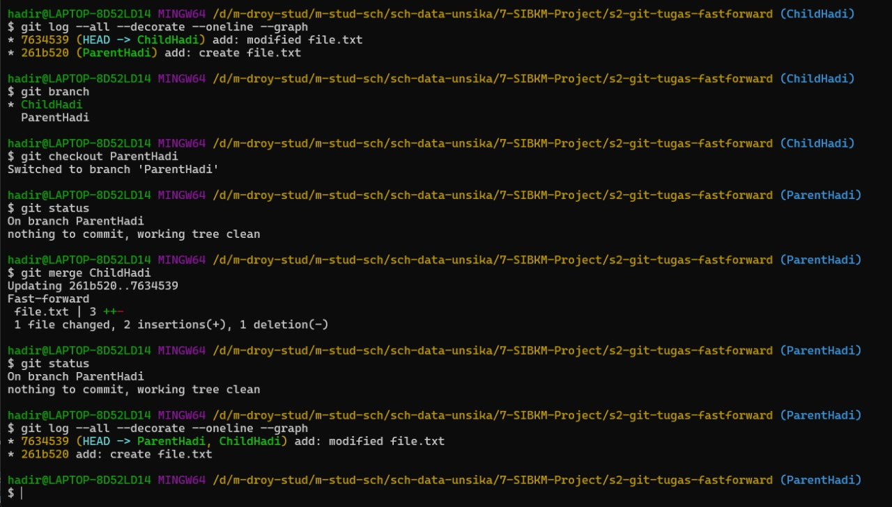

9. Melakukan add origin dan push
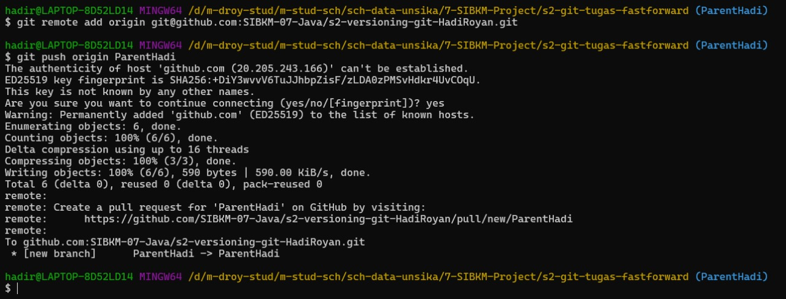

### Tugas: Three way merging

1. Melakukan git clone dan checkout branch ParentHadi
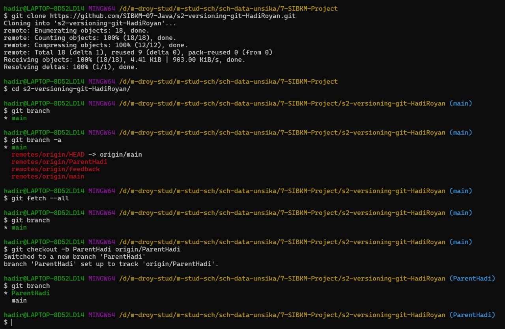

2. Membuat dan checkout branch ChildHadi
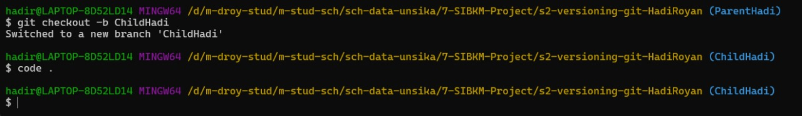

3. Melakukan perubahan pada file.txt di branch ChildHadi
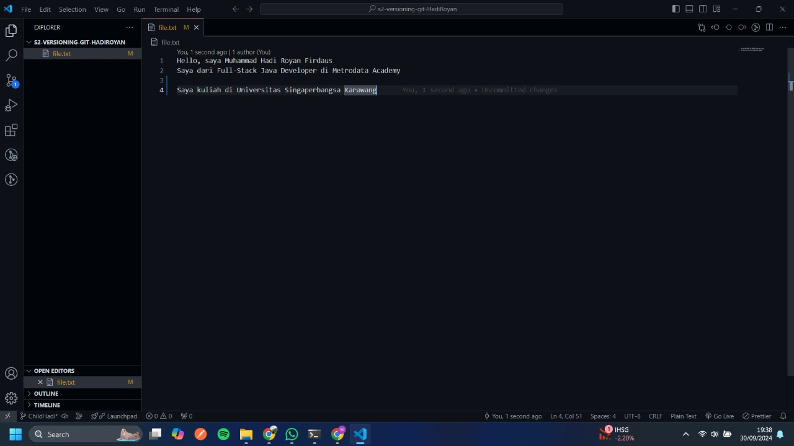

4. Melakukan commit dan push branch ChildHadi
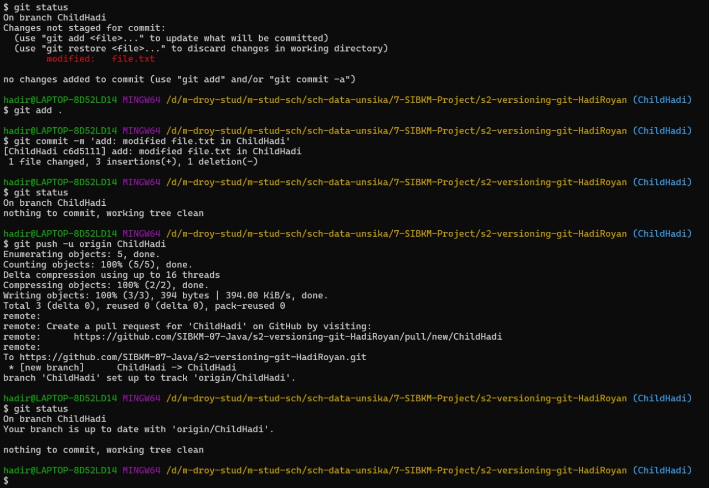

5. Melakukan checkout branch ParentHadi
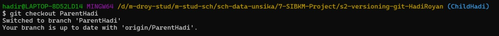

6. Melakukan perubahan pada file.txt di branch ParentHadi
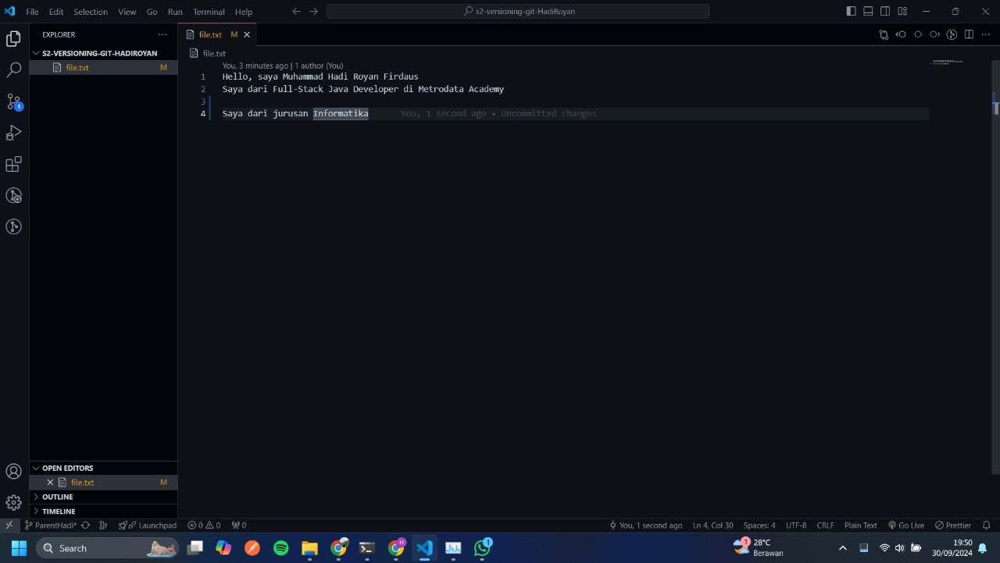

7. Melakukan commit dan push branch ParentHadi
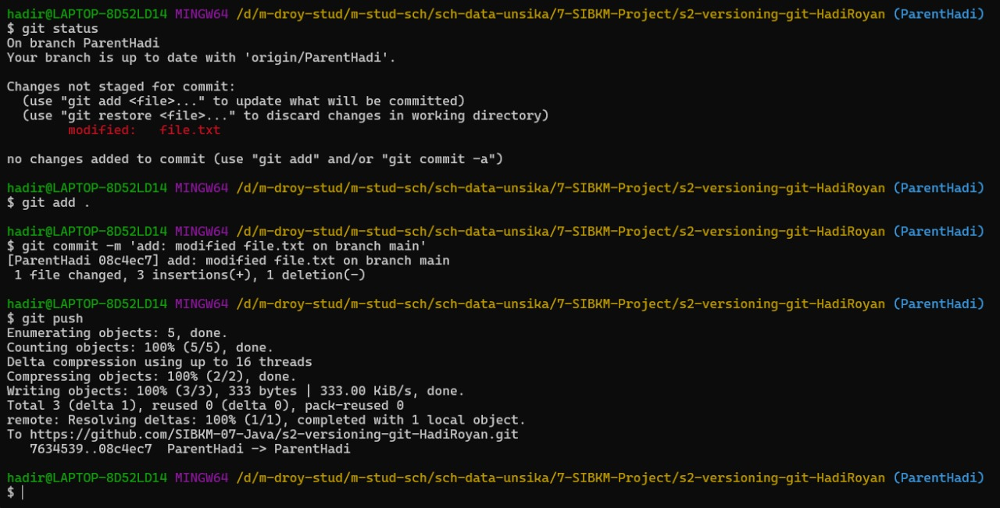

8. Checkout branch ChildHadi
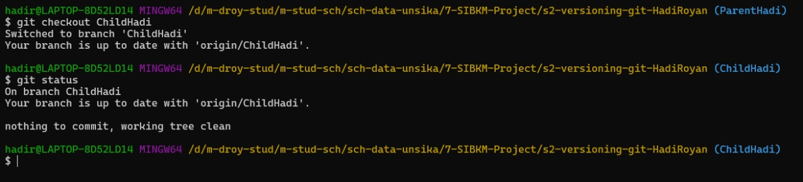

9. Melakukan pull request dari ParentHadi ke ChildHadi (CONFLICT)
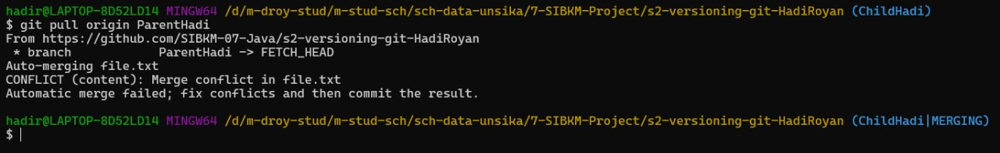

10. Memperbaiki conflict
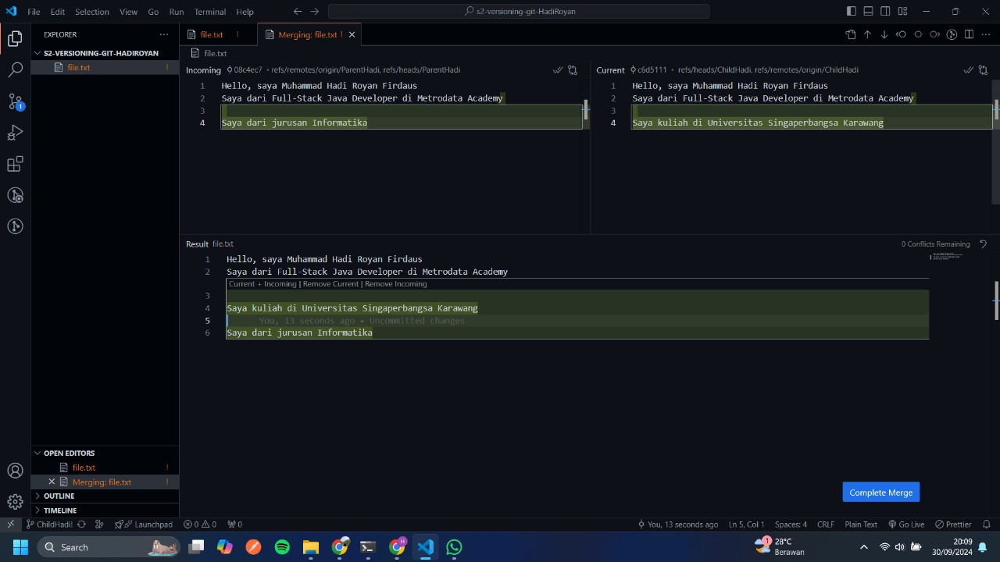

11. Commit perbaikan conflict

12. Membuat pull request baru
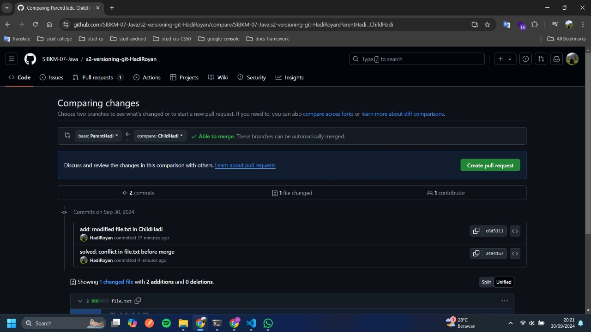

13. Membuat pull request

14. Melakukan merge pull request
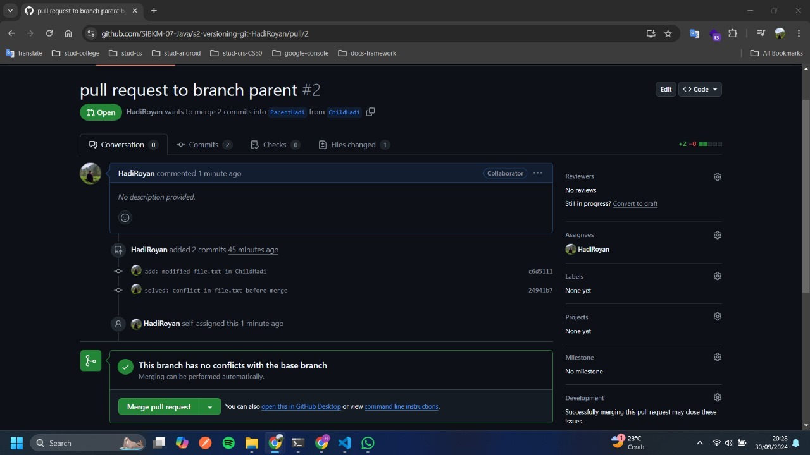

15. Setelah melakukan merge pull request
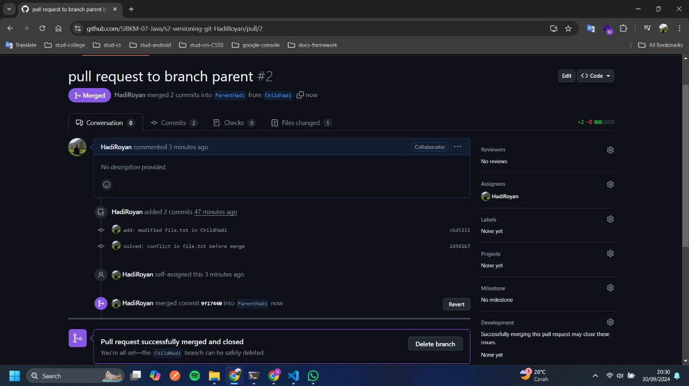

16. Melakukan git pull pada branch ParentHadi
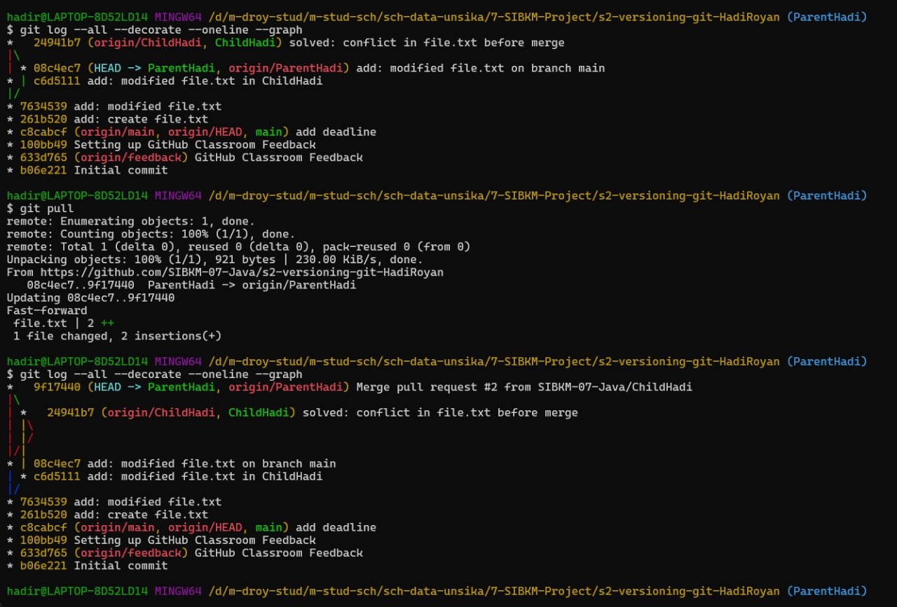